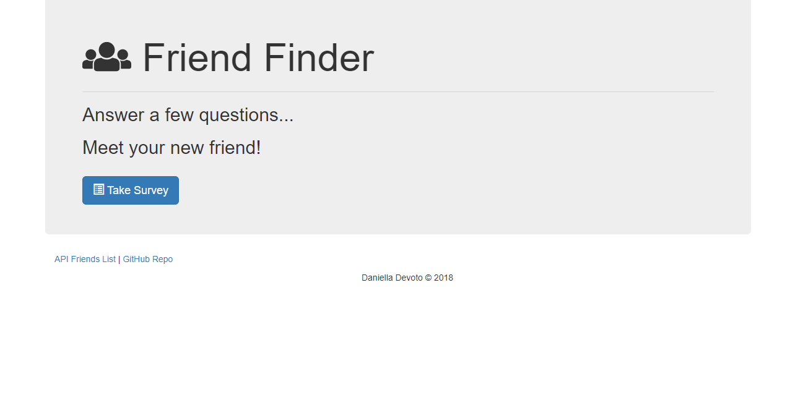
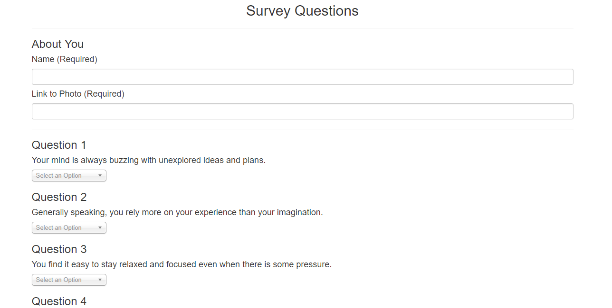

## Friend Finder App using Node and Express Servers

## Overview
* Friend Finder application is a dating app. This full-stack site takes in results from the users' surveys. 
* Each user must provide name and a photo, and then answer ALL 10 questions. 
* Their results will then be compared with those from other users. 
* The app will then display the name and picture of the user with the best overall match.

## Home Page

## Survey Page

